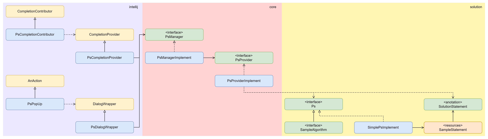

    
    
    
            

# Problem Solving Code Snippets
- Unlock the potential of your code with the Algorithm Codesnippet.
- A unique and creative rendering of standard solvers' algorithms, showcasing the beauty and complexity of coding!

# Getting Started
## IntelliJ Plugin

# Features
- Take exactly what's written in the code
## How to use:
1. Right-click in the editor and select "PS Code Snippet" or press the shortcut key Ctrl+Shift+D.
2. In the opened window, type the problem-solving task you want to find directly 
into the search bar and click the "Search" button or press Enter.
3. The editor will automatically insert the code snippet related to the entered task.
 

## Tips:
- You do not need to enter the complete problem sentence in the search bar.
 You can find relevant snippets by entering only the keywords.
- Snippets can be used as a starting point for solving problems and can be modified
 and extended as needed.
- Use this plugin to practice coding tests efficiently!
 

## Additional information:
- The plugin is available for free on the JetBrains Marketplace.
- The plugin only supports Java.
- The plugin may not work correctly with all IntelliJ IDEA themes.
 

 

# Contributing
- Contributing to ps-code-snippets is very welcome. For basic contributions, all you need is being comfortable with GitHub and Git.
- The best ways to contribute are:
    - Work on new Algorithm (Ps, Statement pair set)
    - Work on documentation
- To ensure equal and positive communication, we adhere to our [Code of Conduct](./CODE_OF_CONDUCT.md). Before starting any interactions with this repository, please read it and make sure to follow.
- Please before contributing check out our [Contributing Guide](./CONTRIBUTING.md) and issues labeled "good first issue": 
 

# Model
## UML: Class Diagram

